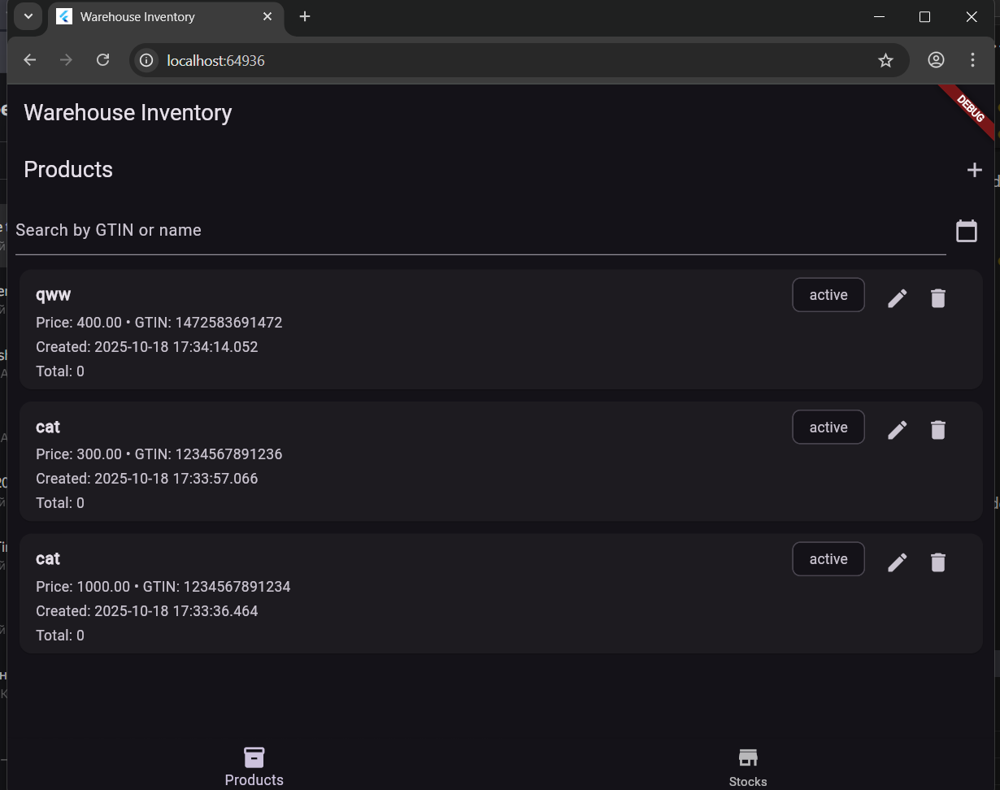
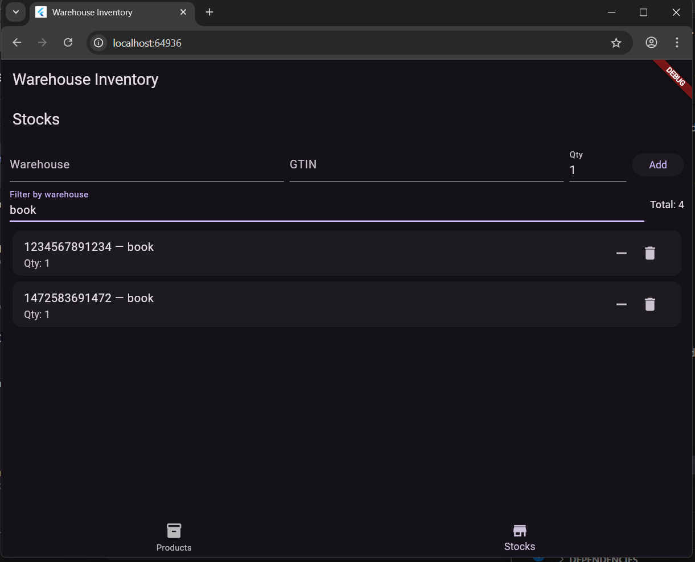

# d_intern
#  Мобильное приложение для учёта склада

Это простое и удобное мобильное приложение на **Flutter**, которое позволяет легко управлять товарами на складе и следить за их остатками.  
С его помощью можно **добавлять новые товары, редактировать или удалять существующие, а также просматривать весь список товаров**.  
Все данные хранятся локально через **Hive**, поэтому информация не потеряется после закрытия приложения.

---

##  Основные функции
- Добавление товаров с названием, GTIN и ценой  
- Редактирование и удаление товаров  
- Просмотр полного списка товаров  
- Хранение данных локально через Hive  
- Удобный и простой интерфейс  

---

##  Используемые технологии
- Flutter & Dart  
- Hive (локальное хранилище)  
- Provider / BLoC (для управления состоянием, при необходимости)  
- UUID (уникальные идентификаторы товаров)  

---

##  Скриншоты
| Главный экран | Добавление товара |
|---------------|-----------------|---------------------|
|  |  
---

##  Видео демонстрация
Смотрите короткое видео работы приложения:  
[ Demo Video](https://drive.google.com/file/d/1OgvJhwvoaB8LrGUf8pv22pQmdwlQ2A3c/view?usp=sharing)

---

##  Как запустить проект
### 1. Клонируем репозиторий
```bash
git clone 


2. Устанавливаем зависимости
cd d_intern
flutter pub get

3. Запускаем приложение
flutter run

### Об авторе
 Талшын Бекжунис
Flutter-разработчик | UIB University

